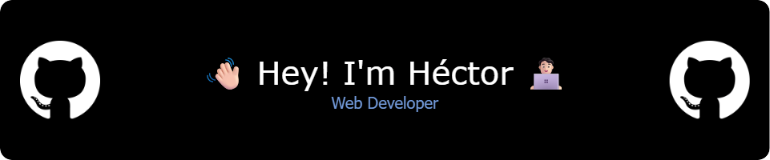

<!-- Encabezado con imagen -->


<!-- Código decorativo -->
``` JS
  const hector = {
    pronouns: "he" | "him",
    code: ["HTML", "CSS", "Javascript", "Python", "Java", "SQL"],
    tools: ["Boostrap", "React", "Node"]
  }
```

<br>

<!-- Sección: Sobre mí -->
<h2>📖 About Me</h2>
<p> 
  🧑🏻‍💻 Web development enthusiast, focused on creating modern and efficient solutions 
</p>
<p> 
  🎓 Pursuing a Higher National Diploma in Web Application Development (DAW)
</p>
<p> 
  🌱 Expanding my skills in both front-end and back-end technologies
</p>

<br>

<!-- Sección: Lenguajes y herramientas -->
<h2>🛠️ Languages and Tools</h2>
<p> 
  <a href="https://skillicons.dev">
    
  </a>
</p>

<br>

<!-- Sección: Estadísticas de GitHub -->
<h2>📊 GitHub Stats</h2>
<p>
  
  <br>
  
</p>

<br>

<!-- Contador de visitas al perfil -->
<p align="center">
  
</p>

<!-- Contacto -->
<h2>📫 How to Reach Me</h2>
<p>
  <a href="https://www.linkedin.com/in/héctor-santana" target="_blank" rel="noopener noreferrer">
    
  </a>
</p>

<br>

<!-- Invitación a conectar -->
<h2>🤝 Let's Connect</h2>
<p>
  I'm always open to collaborating on interesting projects or just having a chat about web development!
</p>

<!--
**HectorSantanaC/HectorSantanaC** is a ✨ _special_ ✨ repository because its `README.md` (this file) appears on your GitHub profile.

Here are some ideas to get you started:

- 🔭 I’m currently working on ...
- 🌱 I’m currently learning ...
- 👯 I’m looking to collaborate on ...
- 🤔 I’m looking for help with ...
- 💬 Ask me about ...
- 📫 How to reach me: ...
- 😄 Pronouns: ...
- ⚡ Fun fact: ...
-->
