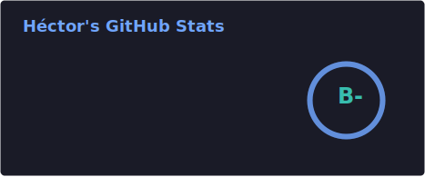
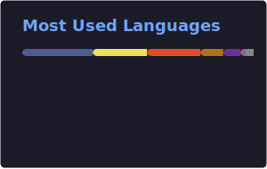

<h3>
  
</h3>

---
## 📖 About Me
- 🧑🏻‍💻 Web development enthusiast focused on creating modern and efficient solutions
- 🎓 Pursuing a Higher National Diploma in **Web Application Development (DAW)**
- 🌱 Expanding my skills in both front-end and back-end technologies
- 🔧 I love turning complex problems into simple, elegant solutions
---
## 🛠️ Languages & Tools

---
## 📊 GitHub Stats

 

---
## 📫 How to Reach Me

---

*"Code is like humor. When you have to explain it, it's bad."* — Cory House

